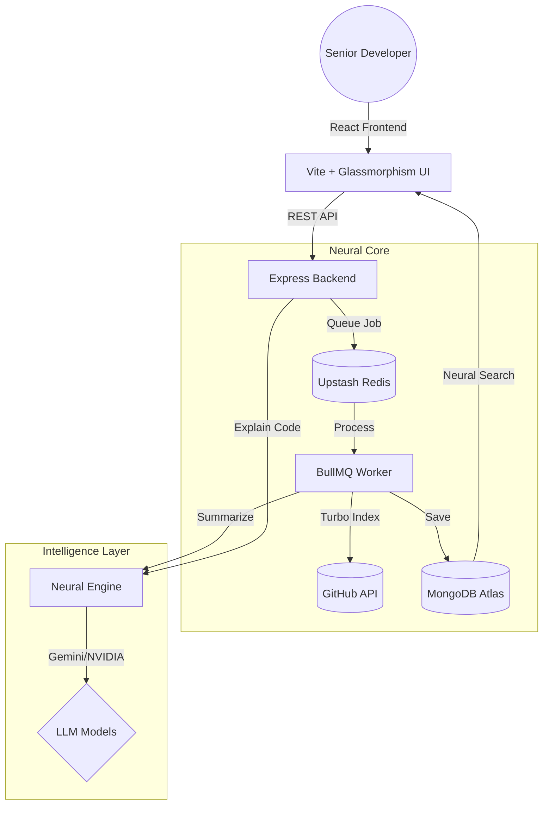

<p align="center">
  
</p>

<h1 align="center">SAMIndex</h1>

<p align="center">
  <b>Next-Generation Neural Code Intelligence & Repository Indexing</b>
</p>

<p align="center">
  
  
  
  
</p>

---

## 🌌 The Neural Vision
**SAMIndex** is a high-fidelity code intelligence platform engineered for senior developers. It doesn't just search code—it **understands** it. By building a "Neural Brain" of your repositories using state-of-the-art LLMs (Gemini & NVIDIA NIM), SAMIndex provides instant, contextual insights that transform complex codebases into searchable, human-readable intelligence.

## 🧠 Neural Features
- **Dual-Provider AI Engine**: Native support for **Google Gemini 1.5 Flash** and **NVIDIA NIM (Llama 3.1)**. The engine automatically detects your API key and optimizes prompts for the active model.
- **Automated Workspace Summarization**: During indexing, SAMIndex automatically analyzes your `README.md` to generate a high-level value proposition for the repository.
- **Turbo Indexing Strategy**: 
  - **Primary**: High-speed ZIP-based scanning (reduces API calls by 90%).
  - **Fallback**: Granular GitHub API discovery for edge cases.
- **Digital Obsidian UI**: A premium, state-of-the-art interface built with **glassmorphism**, fluid Framer Motion animations, and dark-mode optimization.
- **Workspace Isolation**: Deep-search within a specific repository or perform global neural queries across your entire indexed ecosystem.

---

## 🏗 System Architecture

SAMIndex is built on a resilient, event-driven architecture designed for high-throughput repository processing.



### Technical Specs
| Layer | Technology |
| :--- | :--- |
| **Frontend** | React 18, Vite, Framer Motion, Vanilla CSS (Design Tokens) |
| **Backend** | Node.js, Express, Passport.js (Google Strategy) |
| **Data Core** | MongoDB Atlas, Upstash Redis (Serverless) |
| **Background** | BullMQ (Event-driven indexing) |
| **AI** | @google/generative-ai, NVIDIA NIM (Llama 3.1) |

---

## 🛠 Tech Stack Details

### Frontend: Digital Obsidian Aesthetic
We avoided generic UI libraries to build a custom **Design System**.
- **Glassmorphism**: Layered transparency with backdrop-blur filters for a premium feel.
- **Micro-interactions**: Subtle haptic-like animations using Framer Motion.
- **Neural Scan UX**: Interactive progress bars and "neural establish" sequences during indexing.

### Backend: Distributed Indexing
- **ZIP-Stream Processing**: We download repository snapshots and process them in-memory to bypass GitHub's strict rate limits.
- **Atomic Persistence**: Files are indexed with full path context and owner attribution.
- **Identity Middleware**: Sophisticated auth layer that supports standard JWT sessions and "Developer Mode" via internal API keys.

---

## 🚀 Installation & Setup

### 1. Prerequisites
- Node.js (v18+)
- MongoDB Atlas Instance
- Upstash Redis (or local Redis)
- **AI Keys**: Either a Google Gemini Key or NVIDIA NIM Key (stored in `GEMINI_API_KEY`)

### 2. Environment Configuration (`backend/.env`)
```env
PORT=5000
MONGODB_URI=your_mongodb_uri
JWT_SECRET=your_jwt_secret
GOOGLE_CLIENT_ID=your_google_id
GOOGLE_CLIENT_SECRET=your_google_secret
GITHUB_TOKEN=your_github_token
GEMINI_API_KEY=your_ai_key (detects nvapi- prefix automatically)
REDIS_HOST=your_redis_host
REDIS_PORT=your_redis_port
REDIS_PASSWORD=your_redis_password
```

### 3. Execution
```bash
# Clone & Install
git clone https://github.com/syedmukheeth/SAMIndex.git
npm install # in both frontend and backend

# Start Development Environment
npm run dev # inside respective folders
```

---

## 📈 Roadmap
- [x] AI-Powered Code Summarization
- [x] Multi-provider AI support (Gemini + NVIDIA)
- [ ] **Neural Link 2.0**: Deep-link search (jump to specific line numbers)
- [ ] **Collaborative Brains**: Shared workspaces for teams
- [ ] **Local Mode**: Indexing local directories via CLI

---

<p align="center">Developed with 🖤 by <b><a href="https://www.linkedin.com/in/syedmukheeth/">Syed Mukheeth</a></b></p>
<p align="center"><i>A solo-engineered masterpiece in code intelligence.</i></p>
